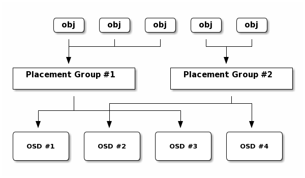

# PG简介

## 一、何为PG

PG（Placement Group），简单而言就是客户端数据存储的容器，在filestore里对应的就是本地文件系统的一个子目录，它是一个逻辑概念，类似于一致性hash算法中引入的虚拟节点；它处于客户端到具体磁盘（OSD）中间，起一个承上启下的作用，对客户端可以屏蔽底层磁盘，数据的存储只与PG有关，只要PG状态正常就可以存取数据。PG通过二次映射到OSD中。

以下为Ceph寻址流程示意图：


从上图可以PG所处的位置，以及其上下关系。

通过引入PG，可以带来如下好处：
- 减小集群扩缩容时带来的数据迁移问题；
- 减少hash分布带来的数据分布不均衡问题；
- 在数据迁移或异常恢复时，所有磁盘都可参与，避免出现热点磁盘，提高效率。

### 1.1 PG与OSD的关系

PG的命名规则为：
>{pool-id}.{pg-id}

其中，
- pool-id，即存储池的ID，十进制表示；
- pg-id采用16进制，其取值范围为[0，pg_num-1]。

PG与OSD的映射关系可以通过如下命令查询：

```
[root@node0 ~]# ceph pg map 1.2d
osdmap e385 pg 1.2d (1.2d) -> up [5,6,1] acting [5,6,1]
```

从查询结果来看，与PG相关的OSD集合包括up和acting两个，其中acting表示集合内的OSD均处于活跃状态，并可以处理PG相关的请求，up表示包含有该PG，并且是处于up状态的OSD。正常情况下PG的up和acting两个集合中的OSD保持一致，且第一个为主OSD。


### 1.2 PG的特点

从应用的角度来看，PG具有如下特点：
- 以存储池（pool）为单位进行设置，在创建存储池时即指定数目，pg的命名中包含有pool的id信息；
- 存储池的特性，如容错策略、分布策略、数据校验、容灾恢复等均依托PG来实现；
- PG的数量一般设置为2的N次方，支持增加，一般不修改，在N版本之前不支持减少；
- 集群内所有存储池PG之和一般设置为OSD数量的100倍，在实践中也常设置为200倍左右；
- PG在OSD中无法做到完全均匀分布，目前可通过ceph-balancer进行自动调整优化；
- 在同一个存储池中，各PG承载的数据块数量基本相同，空间使用也基本相同。


## 二、与PG相关的操作

### 2.1 常见的PG查询命令

| 查询目的                  | 命令行                                                                                          |
|---------------------------|-------------------------------------------------------------------------------------------------|
| 查询pg整体状态            | ceph -s<br> ceph pg stat                                                                        |
| 列出所有pg                | ceph pg ls                                                                                      |
| 按池列出所有pg            | ceph pg ls-by-pool &lt;pool_name&gt;                                                                  |
| 按OSD列出所有pg           | ceph pg ls-by-osd &lt;osdname&#124;id&gt;                                                             |
| 列出指定OSD上的主PG       | ceph pg ls-by-primary &lt;osdname&#124;id&gt;                                                         |
| 设置某存储池PG数量        | ceph osd pool set &lt;poolname&gt; pg_num xxxx                                                        |
| 查询某存储池PG数量        | ceph osd pool get &lt;poolname&gt; pg_num                                                             |
| 获取集群PG的统计信息      | ceph pg dump                                                                                    |
| 列出异常PG                | ceph pg dump_stuck {inactive&#124;unclean&#124;stale&#124;undersized&#124;degraded}             |
| 查询指定PG查询            | ceph pg &lt;pg_id&gt; query&lt;br&gt; ceph tell &lt;pg_id&gt; query                                               |
| 查询PG到OSD的映射关系     | ceph pg map &lt;pg_id&gt;                                                                             |
| 获取所有PG信息            | ceph pg dump                                                                                    |
| 离线查询OSD上所有PG       | ceph-objectstore-tool --data-path /var/lib/ceph/osd/ceph-0/ --op list-pgs                       |
| 离线查询OSD上某个PG的信息 | ceph-objectstore-tool --data-path /var/lib/ceph/osd/ceph-0/ --pgid 1.3c --op info               |
| 离线导出OSD上某个PG的内容 | ceph-objectstore-tool --data-path /var/lib/ceph/osd/ceph-0/ --pgid 1.3c --op export --file 1.3c |
| 离线导入某个PG到OSD中     | ceph-objectstore-tool --data-path /var/lib/ceph/osd/ceph-0/ --pgid 1.3c --op import --file 1.3c |
| 列出指定PG中不连续的对象  | rados list-inconsistent-obj &lt;pgid&gt;                                                              |
| 列出指定PG中不连续的快照  | rados list-inconsistent-snapset &lt;pgid&gt;                                                          |


### 2.2 PG相关的配置参数

在使用过程中，可能引起集群告警或操作异常的参数有：

| 参数                        | 含义                                                                                                                                                                                                         |
|-----------------------------|--------------------------------------------------------------------------------------------------------------------------------------------------------------------------------------------------------------|
| mon_max_pool_pg_num         | 存储池PG数量上限，默认为65536，当创建存储池时指定的pg_num大于此参数，会导致创建失败。                                                                                                                        |
| mon_pg_warn_min_per_osd     | 当集群中OSD的平均PG数小于此参数时，集群报TOO_FEW_PGS，在N版Ceph里，此值为0，默认关闭此告警，早期版本会因为此参数引起集群告警。<br>PG数设置过少，可能导致数据分布不均衡比较严重。                             |
| mon_pg_warn_max_object_skew | 当集群中出现MANY_OBJECTS_PER_PG告警时，通过调整该参数可以消除，该告警说明某个或某几个存储池PG中存储的object数大于所有平均数的mon_pg_warn_max_object_skew倍，即集群中存储池数据分布不均衡比较严重。默认为10。 |
