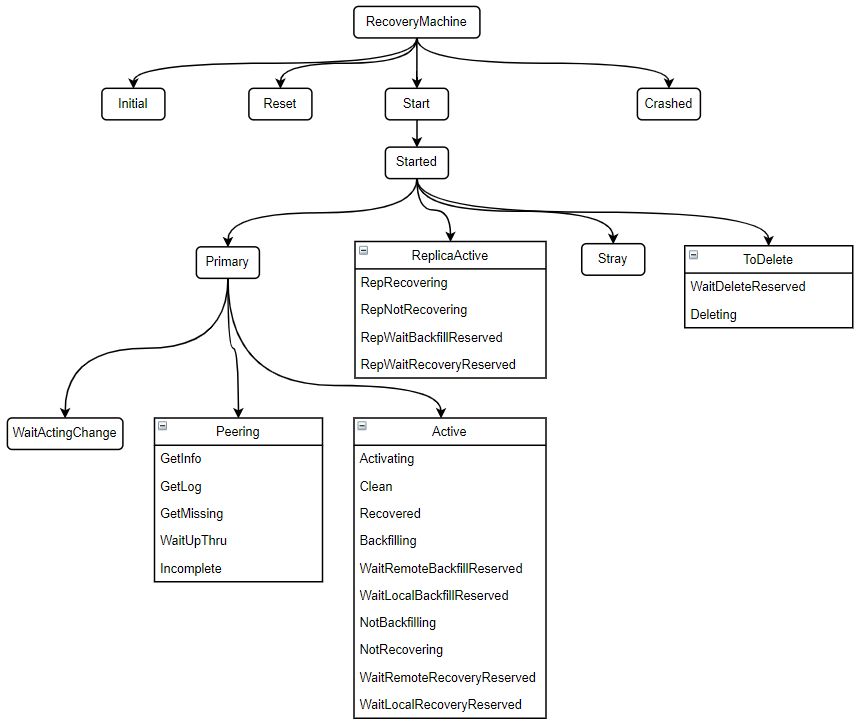

# PG状态机

## 一、PG状态及转化过程

PG随着存储池的创建而产生，也随着存储池的删除而消亡，在其可长可短的一生当中，会经历数量增长（扩容时），也会经历数量减少（N版后支持），同时也会由于经受各种考验而呈现出不同的状态；对于运维人员而言，最喜欢也最放心的状态是active+clean，也是Ceph运维的目标。
PG的状态管理由RecoveryMachine成员管理，其状态转换如下图所示：

引起PG状态变化的主要场景有：
* 新建存储池，PG处于创建过程中；
* 新增或者删除OSD，进行数据迁移；
* OSD出现故障，进行数据恢复；
* 修改CRUSH map，进行数据迁移；
* PG各副本之间出现数据不一致；
* PG副本在进行数据校验；
* 存储系统无足够空间进行数据迁移或者恢复；
* OSD重启等。

## 二、各状态含义及触发条件

| PG状态       | 代表的含义/产生的条件                                                                                                       |
|--------------|-----------------------------------------------------------------------------------------------------------------------------|
| creating     | 表示PG正在被创建，通常以下两种情况下出现： 1.当存储池正在被创建； 2.增加一个存储池的PG数量时。                        |
| down         | 表示PG处于失效状态，一般出现在PG所在的OSD异常时。                                                                           |
| repair       | 表示PG正在被检查，被发现的任何不一致都将尽可能被修复。                                                                      |
| peering      | 由主OSD发起的，使存放PG副本的所有OSD就PG的所有对象和元素数据的状态达成一致的过程，该过程完成后主OSD就可以接受客户端写请求。 |
| active       | PG完成peering后，会变成active状态，意味着： 1.PG中的数据变得可用； 2.PG可响应读写请求。                               |
| clean        | 当PG显示CLEAN状态，主OSD与副本OSD成功同步并且没有异步复制，CEPH在PG中所有对象具有正确的副本数量。                           |
| replay       | 某OSD崩溃后，PG正在等待客户端重新发起操作。                                                                                 |
| inconsistent | PG副本出现不一致，对象大小不正确或者恢复结束后某个副本出现对象丢失现象。                                                    |
| recoverying | 该过程表明PG正在做数据恢复，恢复到正确的副本数。 通常在系统出现磁盘或者节点故障一段时间后，其恢复速度和开始时间均可以精确控制并在线修改。  常用的控制参数包括： osd_recovery_max_active osd_recovery_delay_start osd_recovery_op_priority osd_recovery_priority osd_recovery_retry_interval osd_recovery_sleep osd_repair_during_recovery osd_scrub_during_recovery|
| backfilling | 该状态表明数据正在做全量同步，或者迁移，通常发生在两种场景： 1. PG副本间数据相差较大，recovery不了，直接全量同步； 2. 2.系统扩缩容时的数据重新均衡。  在 backfill 操作期间，可以看到多种状态： 1. backfill_wait 表示条件不具备，操作还未开始，如手动停止、目标磁盘容量不够等； 2. backfilling 表示操作正在执行； 3. backfill_too_full 表示由于目标磁盘容量不足，操作停止。  常用的相关参数有： mon_osd_backfillfull_ratio osd_backfill_retry_interval osd_max_backfills osd_backfill_scan_min osd_backfill_scan_maxosd_max_backfills|
| remapped    | 该状态表明PG将更新与OSD的映射关系，此时使用ceph pg map命令查询时，会发现acting set和up set不一致。  通常出现在集群Map发生变化时，如集群扩缩容、CRUSH规则修改、OSD权值修改等。 在remapped过程中，当主OSD发生变化时，旧的主OSD会一直服务到数据迁移完成，即PG恢复正常。 |
| stale       | 处于该状态时，意味着无法获得主OSD，有如下可能性： 集群才启动，PG peering还未完成； 由于网络异常，导致主OSD无法向monitor及时同步状态信息； 短时间内，PG所对应的OSD全部故障离线。|
|   scrubbing|PG 在做数据一致性校验，包括scrub和deep-scrub，前者只进行基本的元数据信息校验，后者包括数据完整性校验。 是防止数据出现静默错误的有效手段。  常用的控制参数包括： mon_scrub_interval osd_deep_scrub_interval osd_max_scrubs osd_scrub_begin_hour osd_scrub_end_hour osd_scrub_chunk_min osd_scrub_chunk_max osd_scrub_priority osd_scrub_sleep osd_scrub_load_threshold  手动操作命令有： ceph pg {scrub&#124;deep-scrub} <pg_id> ceph osd {set&#124;unset} {noscrub&#124;nodeep-scrub}|
| inactive   | PG 很长时间没有显示为 acitve 状态 处于此状态的PG 不可以执行读写， 要等待 OSD 更新数据到最新的备份状态，通常都是由于OSD离线引起。|
| unclean    | PG很长时间都不是clean状态 (如无法完成恢复操作)，PG包含对象没有完成相应的复制副本数量， 通常都要执行恢复操作。|
| incomplete | Peering过程中由于无法选出权威日志或者通过choose_acting选出的acting不足以完成数据恢复，（例如针对纠删码，存活的副本数小于k值）等，导致Peering无法正常完成。即PG元数据丢失，无法恢复PG状态。 |
   
